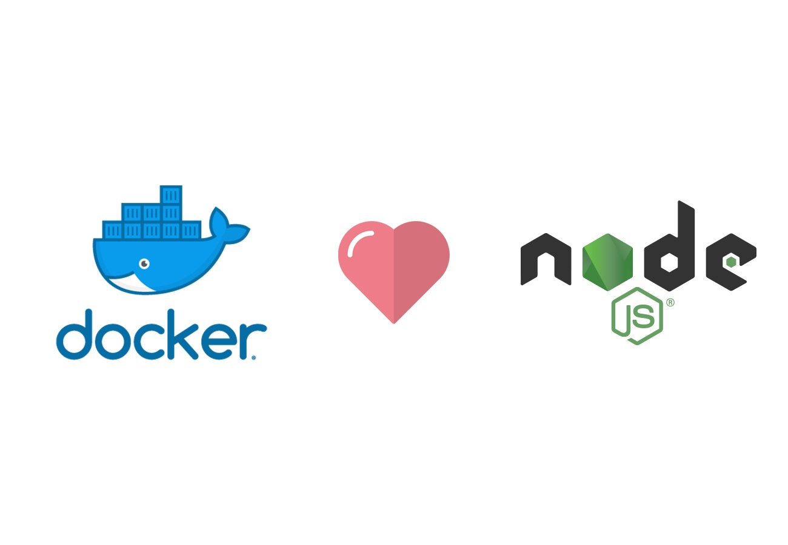

<div align="center">

# Docker Image for Forgejo Runner



## What is this?

Docker images for Forgejo CI/CD runners with various Node.js versions and Docker variants.

</div>

## Usage

```bash
docker pull ghcr.io/hidemaruowo/forgejo-runner-docker-image:latest
docker run -d ghcr.io/hidemaruowo/forgejo-runner-docker-image:latest
```

- Runner labels
```yaml
labels: ["host", "docker:docker://ghcr.io/hidemaruowo/forgejo-runner-docker-image:latest" ]
```

## Dependencies

- Docker (for pulling and running the images)

## Available Images

Images are automatically built and pushed to GitHub Container Registry (ghcr.io) monthly.

### Tags

- `ghcr.io/hidemaruowo/forgejo-runner-docker-image:latest` - Node.js 20 with docker:dind (default)
- `ghcr.io/hidemaruowo/forgejo-runner-docker-image:node18-dind` - Node.js 18 with docker:dind
- `ghcr.io/hidemaruowo/forgejo-runner-docker-image:node20-dind` - Node.js 20 with docker:dind
- `ghcr.io/hidemaruowo/forgejo-runner-docker-image:node22-dind` - Node.js 22 with docker:dind
- `ghcr.io/hidemaruowo/forgejo-runner-docker-image:node18-dind-rootless` - Node.js 18 with docker:dind-rootless
- `ghcr.io/hidemaruowo/forgejo-runner-docker-image:node20-dind-rootless` - Node.js 20 with docker:dind-rootless
- `ghcr.io/hidemaruowo/forgejo-runner-docker-image:node22-dind-rootless` - Node.js 22 with docker:dind-rootless
- `ghcr.io/hidemaruowo/forgejo-runner-docker-image:node18-cli` - Node.js 18 with docker:cli
- `ghcr.io/hidemaruowo/forgejo-runner-docker-image:node20-cli` - Node.js 20 with docker:cli
- `ghcr.io/hidemaruowo/forgejo-runner-docker-image:node22-cli` - Node.js 22 with docker:cli

## What's Included

Each image includes:

- Docker (dind or dind-rootless, cli variant)
- Node.js (version 18, 20, or 22)
- npm
- corepack
- bash
- curl
- wget
- git

## Building Locally

To build a specific variant:

```bash
# Build with Node.js 20 and dind (default)
docker build -t forgejo-runner:node20-dind .

# Build with Node.js 18 and dind
docker build --build-arg NODE_VERSION=18 --build-arg DOCKER_VARIANT=dind -t forgejo-runner:node18-dind .

# Build with Node.js 22 and dind-rootless
docker build --build-arg NODE_VERSION=22 --build-arg DOCKER_VARIANT=dind-rootless -t forgejo-runner:node22-dind-rootless .
```

## Automated Builds

Images are automatically built and published:

- Monthly on the 1st of each month at 00:00 UTC
- On every push to the main branch
- Can be triggered manually via workflow_dispatch

## Reference

- [docker-library/docker](https://github.com/docker-library/docker): Dockerfiles, scripts..
